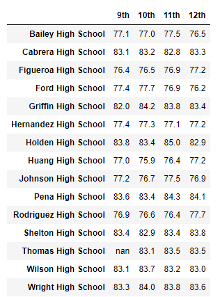

# School District Analysis

## Overview of the School District Analysis
The analysis was originally performed on reading and math scores for 9th-12th grade students within 15 high schools in the district. However, evidence on academic dishonesty was found. Therefore, the reading and math scores for 9th graders at Thomas High School have been compromised. The resolution is to replace the scores with "NaN" or "Not a Number" and repeat the school district analysis to see if these changes would affect the overall school district analysis.

## Results

### District Summmary

The difference in the District Summary is minor. When the numbers are rounded appropriately, the difference is not noticeable since the average scores and passing percentage are identical. When the numbers are not rounded, the difference is only slightly noticeable. 
- The Average Math Score decreased by approximately 0.05 points from the old to new average.
- The Average Reading Score decreased by approximately 0.02 points from the old to new average.
- The Math Passing Percentage decreased by approximately approximately 0.2% from the old to new percentage. 
- The Reading Passing Percentage decreased by approximately 0.1% from the old to new percentage. 
- The Overall Passing Percentage decreased by approximately 0.3% from the old to new percentage. 

### School Summary

When removing the 9th grade math and reading scores from Thomas High School, the difference in average math and reading scores do not change since the average scores do not consider the NaN in the averages. However, the passing percentage takes a sharp decrease since it still includes the number of 9th grade students at Thomas High School in the Total Students count. When the 9th grade math and reading scores have been removed for Thomas High School, the old averages and and passing percentages were replaced with the new averages and passing percentages that only considers the scores for 10th-12th graders from Thomas High School. The analysis of the replacement is below:
- The Average Math Score decreased by approximately 0.07 points from the old to new average.
- The Average Reading Score increased by approximately 0.05 points from the old to new average.
- The Math Passing Percentage decreased by approximately approximately 0.09% from the old to new percentage. 
- The Reading Passing Percentage decreased by approximately 0.3% from the old to new percentage. 
- The Overall Passing Percentage decreased by approximately 0.3% from the old to new percentage. 

### Replacing 9th Graders' Math and Reading Scores Effect on Thomas High School's Performance Relative to Other Schools:
After replacing the 9th graders' math and reading scores with NaN, Thomas High School is ranked eighth in the district for overall passing percentage.
After excluding the 9th graders' math and reading scores, Thomas High School is ranked second in the district for overall passing percentage.

### Replacing 9th Grade Scores Effect on:

#### Math and Reading Scores by Grade

The only difference the replacement had on the math and reading scores by grade is that a NaN was reported for the 9th grade math and reading scores for Thomas High School.

#### Scores by School Spending

The only difference the replacement had on the spending summary is on the $630-644 range, since Thomas High School falls in this range for the "Per Student Budget" ($638.00).
- The Average Math Score decreased by approximately 0.02 points from the old to new average.
- The Average Reading Score increased by approximately 0.01 points from the old to new average.
- The Math Passing Percentage decreased by approximately approximately 0.02% from the old to new percentage. 
- The Reading Passing Percentage decreased by approximately 0.07% from the old to new percentage. 
- The Overall Passing Percentage decreased by approximately 0.08% from the old to new percentage. 

#### Scores by School Size

The only difference the replacement had on the size summary is on the Medium (1000-2000) range, since Thomas High School falls in this range for the "Total Students" (1635).
- The Average Math Score decreased by approximately 0.01 points from the old to new average.
- The Average Reading Score increased by approximately 0.01 points from the old to new average.
- The Math Passing Percentage decreased by approximately approximately 0.02% from the old to new percentage. 
- The Reading Passing Percentage decreased by approximately 0.06% from the old to new percentage. 
- The Overall Passing Percentage decreased by approximately 0.06% from the old to new percentage. 

#### Scores by School Type

The only difference the replacement had on the type summary is on the Charter school type, since Thomas High School is a Charter school type.
- The Average Math Score decreased by approximately 0.01 points from the old to new average.
- The Average Reading Score increased by approximately 0.01 points from the old to new average.
- The Math Passing Percentage decreased by approximately approximately 0.01% from the old to new percentage. 
- The Reading Passing Percentage decreased by approximately 0.04% from the old to new percentage. 
- The Overall Passing Percentage decreased by approximately 0.04% from the old to new percentage. 

## Summary
The biggest change in the school district analysis after reading and math scores for the 9th grade at Thomas High School have been replaced  with NaNs is the passing percentage. The passing percentages decreased significantly since it still relied on the same number of total students. However, this data is skewed and average scores and passing percentages were replaced with more accurate numbers that excluded the reading and math scores for the 9th grade at Thomas High School.

After the scores for the 9th grade at Thomas High School have been excluded, the school Summary, scores by grade, scores by school spending, scores by school size, and scores by school type analyses, the average reading score slightly increased. 

Except as noted in the above change, for all other analyses, the average scores and passing percentages decreased slightly. 

After replacing the reading and math scores for the 9th grade at Thomas High School with NaNs, Thomas High School dropped to being the 8th ranked school based on overall passing percentage. After excluding these scores from the analysis, Thomas High School returned back to the 2nd ranked school based on overall passing percentage. 

